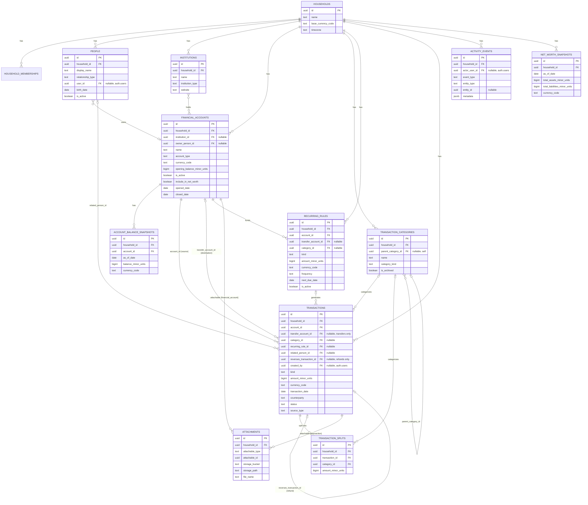

# DhanOS — Financial Domain Model

Status: **core ledger implemented**. Tenancy (`households`/`household_memberships`), identity (`profiles`), and the core relational schema in §2–§3 below (`people`, `institutions`, `financial_accounts`, `account_balance_snapshots`, `transaction_categories`, `transactions`, `transaction_splits`, `recurring_rules`, `attachments`, `activity_events`) exist in `supabase/migrations/` — see [database-plan.md](./database-plan.md) for the concrete column-level spec and [implementation-status.md](./implementation-status.md) for what's built vs. planned. Investment-, insurance-, debt-, and asset-specific tables (§4–§6) remain **proposed** — this document defines the entities and relationships those future migrations must implement.

## 1. Core tenancy entities

- **User** — an authenticated identity (Supabase Auth user).
- **Household** — the tenant/workspace boundary. A user belongs to one or more households (usually one). All financial data hangs off a household, not directly off a user, so shared family finances are representable from day one.
- **Member** (implemented as `household_memberships`) — links a User to a Household with a role (`owner`, `admin`, `editor`, `viewer`) and a status (`active`, `invited`, `suspended` — only `active` grants access).
- **Person** (implemented as `people`, §2) — solves the "member with no login" gap this document previously flagged: a household can now represent a spouse, dependant child, lender, or nominee as a `person` row whether or not they ever sign in, and optionally link that row to an `auth.users` id when they do.

## 2. People, institutions, and accounts — implemented

- **Person** (`people`) — anyone relevant to the household's financial picture: the household member themself, a parent, sibling, spouse, dependant, lender, borrower, nominee, or co-owner (`relationship_type`). Deliberately minimal in v1 — display name, relationship type, optional birth date (for future insurance/emergency-fund age-based logic), notes, active flag — no government IDs, no contact details, no sensitive PII beyond what's already unavoidable. A `person` may optionally reference the `auth.users` row it corresponds to (`user_id`), so "self" rows are the join point between a login and the people/ownership graph, but most relationship types (a dependant child, a lender) never need one.
- **Institution** — a bank, wallet provider, investment platform, insurer, lender, employer, business, government body, or staking platform a household deals with (`institution_type`). Name, website, and free-text support-contact/notes only — no integration credentials live here.
- **Account** (implemented as `financial_accounts`) — held at an Institution (nullable — a cash-in-hand "account" has none), owned by a Person, with a currency, an account type (savings, current, cash, wallet, fixed/recurring deposit, investment, demat, loan, credit, staking, provident fund, pension, other), an opening balance, and an `include_in_net_worth` flag (so e.g. a closed or a tracking-only account can be excluded from rollups without deleting it). **The account row's `opening_balance_minor_units` is a starting point, never the account's current balance** — see `account_balance_snapshots` below and [money-calculation-rules.md](./money-calculation-rules.md) §2.
- **AccountBalanceSnapshot** (`account_balance_snapshots`) — an append-only, dated balance record per account. Current balance is read as "latest snapshot" (or computed from the transaction ledger since the last snapshot), never stored as a single mutable field on `financial_accounts` — this is the concrete enforcement of "a transaction is not the same as an account balance."

## 3. Cash flow — implemented

- **TransactionCategory** (`transaction_categories`) — a household-defined, optionally hierarchical (`parent_category_id`) label with a `category_kind` (income/expense/transfer/investment/debt/other) matching the transaction kinds it can apply to.
- **Transaction** — the atomic ledger entry. Every transaction has a `kind` discriminator: `income`, `expense`, `transfer`, `investment_contribution`, `investment_withdrawal`, `loan_disbursement`, `loan_payment`, `lending_disbursement`, `lending_repayment`, `refund`, `adjustment`. This discriminator is what keeps a transfer from being miscounted as spending — reporting logic must read from the `public.cash_flow_transactions` view (income/expense only, transfers structurally excluded) rather than filtering the raw table itself (see [money-calculation-rules.md](./money-calculation-rules.md)).
- **Transfer** — a `transaction` with `kind = 'transfer'`, `account_id` (source) and `transfer_account_id` (destination) both required and both owned within the same household; v1 requires same-currency transfers (cross-currency/FX is deferred — see [database-plan.md](./database-plan.md) §6). Never counted in income/expense totals.
- **RecurringRule** (`recurring_rules`) — a template (amount, cadence, next-due-date, linked account/category) that generates or is reconciled against actual `transactions` rows via `transactions.recurring_rule_id`; the template itself is never a transaction.
- **Refund** — a `transaction` with `kind = 'refund'` that references the original expense transaction it reverses or partially reverses (`reverses_transaction_id`), rather than being recorded as unlabeled income.
- **TransactionSplit** (`transaction_splits`) — divides one transaction across multiple categories. When splits exist for a transaction, their amounts must sum exactly to the transaction's `amount_minor_units` — enforced by a deferred constraint trigger (see `supabase/migrations/*_transaction_splits.sql`), not application code alone.

## 4. Investing — planned

- **Investment** — a holding (equity, mutual fund, bond, crypto, alternative). Has a cost basis (sum of contribution Transactions) and current value (from ValuationSnapshot).
- **SIP** — a recurring contribution plan against an Investment, analogous to RecurringRule but specific to investment contribution semantics (contribution ≠ expense).
- **StakingPosition** — a crypto asset staked for yield; tracks principal staked, reward accrual events, and lockup terms separately from spot holdings.
- **ValuationSnapshot** — an immutable, dated record of an Investment/StakingPosition/Asset's value. New valuations are inserted, never updated in place (see money-calculation-rules.md, "Historical records").

## 5. Debt — planned

- **Loan** — principal, interest rate/terms, Institution, linked disbursement Account. Tracks outstanding principal as a derived figure from LoanPayment history, not a mutable field.
- **LoanPayment** — an immutable record per payment, split into `principal_component` and `interest_component` (both required, both minor-unit integers) so principal paid-down and interest cost are always distinguishable.
- **Receivable** (lending) — money the household has lent to a third party; tracks principal lent, repayments received (as immutable records), and outstanding balance derived the same way as a Loan but from the lender's side.
- **Liability** — a general obligation not modeled as a formal Loan (e.g. an informal debt, a tax liability), still integer-minor-unit, still currency-tagged.

## 6. Protection & property — planned

- **InsurancePolicy** — type (life, health, term, asset-linked), Institution, coverage amount, premium (amount + cadence), nominees, linked Asset if applicable, renewal date (feeds Reminders).
- **Asset** — movable (vehicle, jewelry, electronics) or immovable (real estate, land); has acquisition cost and a ValuationSnapshot history for current worth.

## 7. Planning — partially implemented

- **Goal** — target amount, target date, linked contribution Transactions or Investments, progress derived from linked records, not manually set. Planned.
- **EmergencyFundPlan** — target coverage (in months of tracked essential expenses), the Account(s) designated as the emergency fund, derived current-coverage figure. Planned.
- **NetWorthSnapshot** (`net_worth_snapshots`) — ✅ implemented — a periodic, immutable rollup of total assets minus total liabilities at a point in time.
- **MonthlyClosing** — a locked report for a given month. Planned.

## 8. Operations & insight

- **Attachment** (`attachments`) — ✅ implemented — a file (Supabase Storage object reference) attached to a `financial_account` or a `transaction` (`attachable_type`/`attachable_id`), with household and referential integrity enforced by trigger rather than a first-class polymorphic FK (Postgres has none — see [database-plan.md](./database-plan.md) §6). Extending `attachable_type` to future entities (Loan, InsurancePolicy, Asset) is a small migration once those tables exist.
- **ActivityEvent** (`activity_events`) — ✅ implemented — an append-only, household-scoped log of notable actions (`event_type`, `entity_type`/`entity_id`, `metadata jsonb`), the foundation of the audit trail called for in [security-model.md](./security-model.md) §5. No automatic instrumentation across every table exists yet; today it is written to explicitly where the application layer chooses to record an event.
- **Reminder** — a dated notice, generated from or linked to a RecurringRule, Loan, InsurancePolicy renewal, or SIP date. Planned.
- **Report** — a generated, dated export of a subset of the data; every Report must carry an explicit data-cutoff timestamp distinct from its generation timestamp. Planned.
- **Projection** — a calculator output. Stores the assumptions used alongside the output. Planned.
- **DecisionJournalEntry** — a dated, free-text-plus-structured record of a financial decision and its stated rationale. Planned.
- **LiteracyContent** — static or semi-static explanatory content keyed to a concept; not user financial data. Planned.

## 9. Relationship summary

```
Household 1──* Member (household_memberships)
Household 1──* Person, Institution, FinancialAccount, TransactionCategory, RecurringRule, Transaction, ActivityEvent
Person 1──* FinancialAccount (owner_person_id)
Institution 1──* FinancialAccount
FinancialAccount 1──* AccountBalanceSnapshot
FinancialAccount 1──* Transaction (account_id; transfer_account_id for kind=transfer)
TransactionCategory 1──* Transaction, TransactionSplit
RecurringRule 1──* Transaction (recurring_rule_id)
Transaction 1──* TransactionSplit (sum of splits = transaction amount)
Transaction (kind=refund) references *one* prior Transaction (reverses_transaction_id, kind=expense)
Transaction (kind=transfer) references *two* FinancialAccounts (account_id "from", transfer_account_id "to"), same household, same currency
{FinancialAccount, Transaction} 1──* Attachment (attachable_type/attachable_id)
Household 1──* NetWorthSnapshot (periodic rollup, append-only)
--- planned, not yet implemented ---
Investment 1──* ValuationSnapshot
Investment 1──* Transaction (kind=investment_contribution)
Loan 1──* LoanPayment
Receivable 1──* RepaymentReceived (mirrors LoanPayment shape)
Asset 1──* ValuationSnapshot
Household 1──* MonthlyClosing (periodic, immutable)
```

## 10. Cross-cutting invariants

- Every money-bearing entity carries `amount_minor_units: bigint` and `currency_code: text` together — never a bare numeric amount (see [money-calculation-rules.md](./money-calculation-rules.md)).
- Every entity that can be "corrected" (LoanPayment, MonthlyClosing, ValuationSnapshot, AccountBalanceSnapshot, NetWorthSnapshot) is append-only at the storage layer; correction = new row referencing/superseding the old one, not an UPDATE of authoritative historical fields.
- Every entity scoped to a Household must be reachable only through that Household's RLS policy — no financial entity should be queryable without a household join (see [security-model.md](./security-model.md)).

## 11. Entity-relationship diagram

Covers the tables implemented as of this document's status line above. Cardinalities read left-to-right (`||` one, `o{` zero-or-many, `}o` many optional).


