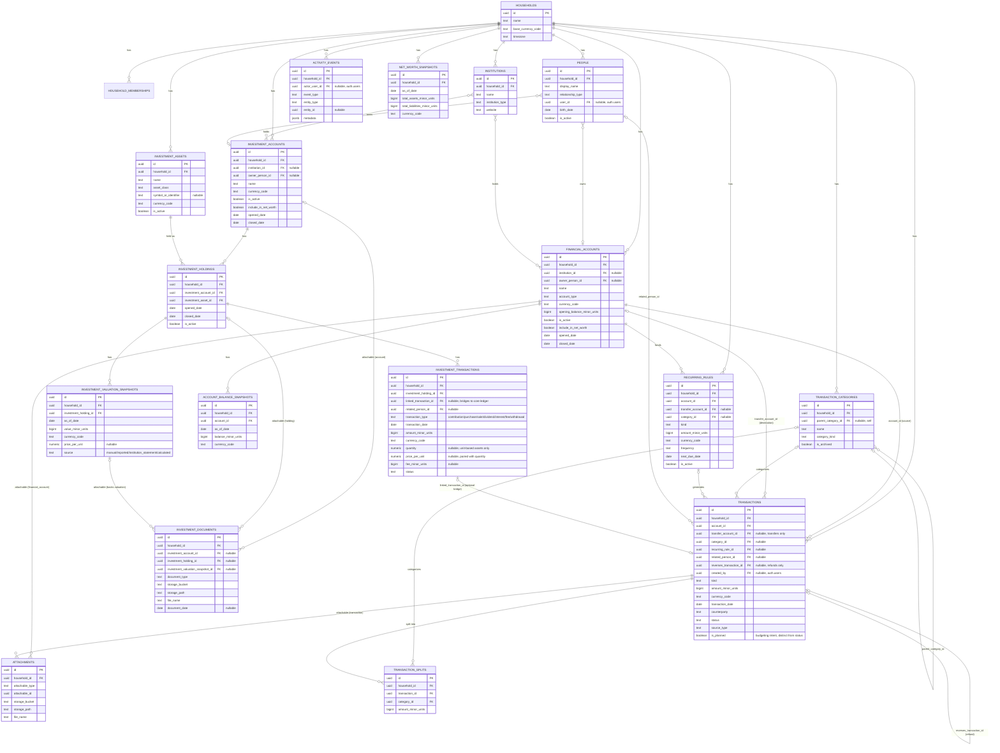

# DhanOS — Financial Domain Model

Status: **core ledger + investment domain + debt/lending/liabilities/insurance/assets/money-drains/goals/emergency-fund/net-worth/monthly-closing/documents-vault/reminders/reports/decision-journal implemented**. Tenancy (`households`/`household_memberships`), identity (`profiles`), the core relational schema in §2–§3 below (`people`, `institutions`, `financial_accounts`, `account_balance_snapshots`, `income_sources`, `transaction_categories`, `transactions`, `transaction_splits`, `recurring_rules`, `attachments`, `activity_events`), the investment domain in §4 (`investment_accounts`, `investment_assets`, `investment_holdings`, `investment_transactions`, `investment_valuation_snapshots`, `investment_documents` — PROMPT 16), debt/lending/liabilities in §5 (`loans`, `loan_payments` — PROMPT 21; `lendings`, `lending_repayments` — PROMPT 23; `liabilities`, `liability_payments` — PROMPT 24), protection/property in §6 (`insurance_policies`, `insurance_policy_insured_people` — PROMPT 25; `insurance_claims`, `insurance_policy_waiting_periods` — PROMPT 26; `assets`, `asset_valuation_snapshots` — PROMPT 27; `money_drains` — PROMPT 29), planning in §7 (`goals`, `goal_responsible_people`, `goal_funding_sources` — PROMPT 30; `emergency_fund_plans`, `emergency_fund_source_overrides` — PROMPT 31; `net_worth_snapshots` grown with its full component breakdown — PROMPT 32; `monthly_closings`, `monthly_closing_review_items` — PROMPT 33), the documents vault in §8 (`documents`, deliberately separate from `attachments` — PROMPT 34), reminders in §8 (`reminders`, generated occurrences of dated obligations across almost every other module — PROMPT 35), reports in §8 (no new table — PROMPT 36), and the decision journal in §8 (`decision_journal_entries`, immutable by trigger once recorded — PROMPT 37) exist in `supabase/migrations/` — see [database-plan.md](./database-plan.md) for the concrete column-level spec and [implementation-status.md](./implementation-status.md) for what's built vs. planned.

## 1. Core tenancy entities

- **User** — an authenticated identity (Supabase Auth user).
- **Household** — the tenant/workspace boundary. A user belongs to one or more households (usually one). All financial data hangs off a household, not directly off a user, so shared family finances are representable from day one.
- **Member** (implemented as `household_memberships`) — links a User to a Household with a role (`owner`, `admin`, `editor`, `viewer`) and a status (`active`, `invited`, `suspended` — only `active` grants access).
- **Person** (implemented as `people`, §2) — solves the "member with no login" gap this document previously flagged: a household can now represent a spouse, dependant child, lender, or nominee as a `person` row whether or not they ever sign in, and optionally link that row to an `auth.users` id when they do.

## 2. People, institutions, and accounts — implemented

- **Person** (`people`) — anyone relevant to the household's financial picture: the household member themself, a parent, sibling, spouse, dependant, lender, borrower, nominee, or co-owner (`relationship_type`). Deliberately minimal in v1 — display name, relationship type, optional birth date (for future insurance/emergency-fund age-based logic), notes, active flag — no government IDs, no contact details, no sensitive PII beyond what's already unavoidable. A `person` may optionally reference the `auth.users` row it corresponds to (`user_id`), so "self" rows are the join point between a login and the people/ownership graph, but most relationship types (a dependant child, a lender) never need one.
- **Institution** — a bank, wallet provider, investment platform, insurer, lender, employer, business, government body, or staking platform a household deals with (`institution_type`). Name, website, and free-text support-contact/notes only — no integration credentials live here.
- **Account** (implemented as `financial_accounts`) — held at an Institution (nullable — a cash-in-hand "account" has none), owned by a Person, with a currency, an account type (savings, current, cash, wallet, fixed/recurring deposit, investment, demat, loan, credit, staking, provident fund, pension, other), an opening balance, and an `include_in_net_worth` flag (so e.g. a closed or a tracking-only account can be excluded from rollups without deleting it). **The account row's `opening_balance_minor_units` is a starting point, never the account's current balance** — see `account_balance_snapshots` below and [money-calculation-rules.md](./money-calculation-rules.md) §2.
- **AccountBalanceSnapshot** (`account_balance_snapshots`) — an append-only, dated balance record per account. Current balance is read as "latest snapshot" (or computed from the transaction ledger since the last snapshot), never stored as a single mutable field on `financial_accounts` — this is the concrete enforcement of "a transaction is not the same as an account balance." A reconciliation snapshot (`source = 'reconciliation'`) carries the user-confirmed balance *and* the ledger-calculated balance at that moment (`calculated_balance_minor_units`), so their difference (`difference_minor_units`, generated) is a permanent, visible fact rather than a value computed once inside `record_account_balance_correction()` and discarded; `adjustment_transaction_id` links directly to the `kind = 'adjustment'` transaction the reconciliation created, if any (PROMPT 13).
- **IncomeSource** (`income_sources`) — a declared, *expected* income stream (salary, a freelance client, rental, etc.): type, an optional Institution (employer/client — `institutions.institution_type` already covers `employer`/`business`, so no separate concept), an optional Person earning it, an optional expected amount (nullable for variable-pay sources), a frequency (weekly through yearly, or `irregular`), an expected day-of-month plus free-text date rule, a required receiving Account, start/end dates, and a tax-withholding expectation. **Creating or editing a source never itself records income** — it is purely the expectation an actual receipt is later compared against (see Transaction, below, and `src/lib/calculations/income-schedule.ts` for the missed-income/next-expected math).

## 3. Cash flow — implemented

- **TransactionCategory** (`transaction_categories`) — a household-defined, optionally hierarchical (`parent_category_id`) label with a `category_kind` (income/expense/transfer/investment/debt/other) matching the transaction kinds it can apply to.
- **Transaction** — the atomic ledger entry. Every transaction has a `kind` discriminator: `income`, `expense`, `transfer`, `investment_contribution`, `investment_withdrawal`, `loan_disbursement`, `loan_payment`, `lending_disbursement`, `lending_repayment`, `liability_incurred`, `liability_payment`, `refund`, `adjustment`. This discriminator is what keeps a transfer from being miscounted as spending — reporting logic must read from the `public.cash_flow_transactions` view (income/expense only, transfers structurally excluded) rather than filtering the raw table itself, **except** where a report needs a column added to `transactions` after that view was created (e.g. `is_planned`, below) — a `select *` view's column list is fixed at creation time in Postgres and does not pick up later columns, so those reads filter `kind = 'expense'`/`'income'` directly instead (see [money-calculation-rules.md](./money-calculation-rules.md)). An income transaction may optionally reference the IncomeSource it fulfills (`transactions.income_source_id`, constrained to `kind = 'income'` only) — the join point "compare expected with received" reads from. `transactions.is_planned` (PROMPT 12) is a budgeting-intent flag — whether an expense was anticipated/budgeted for — distinct from `status`'s planned/pending/cleared/cancelled/reconciled lifecycle state.
- **Transfer** — a `transaction` with `kind = 'transfer'`, `account_id` (source) and `transfer_account_id` (destination) both required and both owned within the same household. Same-currency transfers need nothing further; a cross-currency transfer requires an explicit `transfer_destination_amount_minor_units` (what the destination account actually receives, in its own currency) and `exchange_rate` together, enforced by `check_transaction_consistency()` — the app never looks up or invents a rate (PROMPT 13; see [database-plan.md](./database-plan.md) §6). An optional `transfer_fee_minor_units` reduces the source side only — money that leaves but never arrives anywhere — and is never counted as an expense. A transfer may itself be reversed (a new transfer with the accounts swapped, linked via `reverses_transaction_id`, same-currency only — a cross-currency reversal needs its own freshly-entered rate). Never counted in income/expense totals.
- **RecurringRule** (`recurring_rules`) — a template (amount, cadence, next-due-date, linked account/category) that generates or is reconciled against actual `transactions` rows via `transactions.recurring_rule_id`; the template itself is never a transaction. `status` (active/paused/ended) governs whether it's currently scheduling; `auto_create_mode` decides whether a due occurrence writes a `status = 'planned'` transaction on its own or only ever surfaces as a reminder for a human to confirm (PROMPT 14 — never auto-writes a `'cleared'` transaction). A scheduled future amount change lives in `recurring_rule_amount_schedules`, never as an in-place edit of the rule's own amount, so an occurrence already generated is never retroactively rewritten. Every state transition (created, an amount change scheduled, paused, resumed, one occurrence skipped, ended, one occurrence generated) is logged as an append-only `recurring_rule_events` row — the rule's "recurrence history."
- **Refund** — a `transaction` with `kind = 'refund'` that references the original expense transaction it reverses or partially reverses (`reverses_transaction_id`), rather than being recorded as unlabeled income.
- **TransactionSplit** (`transaction_splits`) — divides one transaction across multiple categories. When splits exist for a transaction, their amounts must sum exactly to the transaction's `amount_minor_units` — enforced by a deferred constraint trigger (see `supabase/migrations/*_transaction_splits.sql`), not application code alone.

## 4. Investing — implemented (PROMPT 16–19)

Six tables, deliberately kept distinct so no investment is ever modeled as a single mutable value (PROMPT 16's central instruction):

- **InvestmentAccount** (`investment_accounts`) — the platform/custody account: a demat account, a mutual fund folio, a crypto exchange wallet, a PPF/EPF/NPS account, or a self-custody wrapper (e.g. "physical gold at home") with no Institution. Has its own settlement currency, but is never assumed to hold only that currency — see InvestmentAsset. No `account_type` enum: a single platform account routinely holds many different asset classes at once, so "type" belongs to what's held, not the account.
- **InvestmentAsset** (`investment_assets`) — the specific security/instrument (e.g. "Reliance Industries Ltd", "HDFC Balanced Advantage Fund", "Bitcoin"), tagged with one of 17 `asset_class` values (mutual fund, stock, ETF, bond, fixed deposit, recurring deposit, gold, digital gold, PPF, EPF, NPS, crypto, staking, private business, private lending, real estate investment, other) and its own `currency_code`. Household-scoped, not a shared security master — this app has no external market-data feed (see [product-scope.md](./product-scope.md) §4), so two households independently maintain their own catalog entries even for the "same" instrument.
- **InvestmentHolding** (`investment_holdings`) — the position linking one InvestmentAccount to one InvestmentAsset, unique per pair for its whole lifecycle. This is where "multiple holdings can exist on one platform" is structurally true (one account, many holdings) — and where "do not model all investments as a single mutable value" is enforced: a holding carries no quantity or current-value column at all. Quantity and cost basis are derived by summing its InvestmentTransactions; current value is read as the latest InvestmentValuationSnapshot — the same "derive, never store a mutable balance" pattern Account/AccountBalanceSnapshot already established (§2).
- **InvestmentTransaction** (`investment_transactions`) — every contribution/purchase/sale/dividend/interest/fee/withdrawal event against a holding, discriminated by `transaction_type` (kind-discriminated single table, same shape as the core ledger's `Transaction.kind`). Carries `quantity`/`price_per_unit` (both nullable together — present for unit-based assets like stocks/funds/crypto, absent for lump-sum assets like an FD/PPF/EPF/NPS contribution) as plain `numeric`, not minor units — the one deliberate exception to the minor-units rule, for the same reason `Transaction.exchange_rate` already is (a fund NAV routinely needs more precision than a currency's own minor-unit exponent). Deliberately a *separate* table from the core ledger's `Transaction` (investment activity needs quantity/price, plain cash-flow transactions don't), but bridges back to it via a nullable `linked_transaction_id`, so a contribution/sale that actually moved cash through a bank Account can still surface in cash-flow reporting (PROMPT 15's dashboard reads `Transaction.kind = investment_contribution/investment_withdrawal`) without a second, disconnected source of truth. Editable + soft-cancelable (`status`), like the core ledger — not append-only.
- **InvestmentValuationSnapshot** (`investment_valuation_snapshots`) — an append-only, dated value per InvestmentHolding, with a `source` of exactly `manual`, `imported`, `institution_statement`, or `calculated` (PROMPT 16's specified list). New valuations are inserted, never updated in place (see [money-calculation-rules.md](./money-calculation-rules.md) §3, "Historical records") — the concrete answer to "historical valuations remain available."
- **InvestmentDocument** (`investment_documents`) — a Supabase Storage object reference (statement/contract note/certificate/tax document) linked to an InvestmentAccount, an InvestmentHolding, and/or the InvestmentValuationSnapshot it backs (at least one required). Kept as its own table per PROMPT 16's explicit table list, rather than extending the generic `Attachment`'s polymorphism.

**Currency isolation**: an InvestmentAccount's currency, an InvestmentAsset's currency, and any other holding's asset currency are never combined without an explicit conversion — enforced by trigger (an InvestmentTransaction/InvestmentValuationSnapshot's `currency_code` must match its holding's asset currency), and left for a future reporting layer to convert explicitly rather than silently sum across currencies (PROMPT 16 acceptance criterion; see [product-scope.md](./product-scope.md) §4's "no live FX conversion engine in v1").

**SIP (`investment_sips`, PROMPT 17)** — a recurring contribution plan template, referencing one InvestmentHolding (so its asset/platform are always derived, never duplicated), a contribution amount/cadence, a contribution Account (bank-side source of cash), and a lifecycle `status` (planned/active/paused/completed/cancelled). Recording an actual contribution writes an InvestmentTransaction (`transaction_type = contribution`, `investment_sip_id` set) linked back to a core-ledger Transaction (`kind = investment_contribution`) — all in one atomic RPC (`record_investment_sip_contribution`) alongside advancing `next_due_date` and logging an append-only `investment_sip_events` row. A partial unique index on `investment_transactions (investment_sip_id, transaction_date)` makes recording the same occurrence twice structurally impossible.

**Portfolio & performance reporting (PROMPT 18)** — not a new entity, a read layer over the tables above: per-holding cost basis (weighted-average, since there is no per-lot tracking), realized/unrealized gain-loss, income received (dividends/interest only — never a valuation change), fees, absolute return, and an annualized return (XIRR, `src/lib/calculations/xirr.ts`) with documented non-convergence handling. See `src/features/investments/queries.ts`.

**Staking / daily value tracking (`staking_positions`, `staking_daily_snapshots`, PROMPT 19)** — a dedicated pair of tables for positions whose value is tracked day by day rather than by occasional valuation snapshots (the generic `staking` `asset_class` alone wasn't enough structure for this, resolving the "not yet built" note from PROMPT 17/18). **StakingPosition** (`staking_positions`) references one InvestmentHolding (same "derive platform/asset, never duplicate" pattern as SIP) plus opening principal/date, currency, an optional `expected_daily_rate` (a stated assumption, never a guarantee), lock-in end date, fee/risk notes, and a `status` (active/paused/closed). **StakingDailySnapshot** (`staking_daily_snapshots`) is append-only but *revision-versioned* rather than strictly single-row-per-day: `unique (staking_position_id, snapshot_date, revision)` plus a CHECK requiring a non-empty `adjustment_reason` whenever `revision > 1` is the mechanism behind "one snapshot per position per day unless adjustments are explicitly versioned" — a corrected day is a new, explained revision row, never an overwrite of the original. A `staking_daily_snapshots_current` view (`DISTINCT ON (staking_position_id, snapshot_date) ORDER BY revision DESC`) surfaces the latest revision for reporting. Every row's `closing_value_minor_units` is enforced by a CHECK to equal `opening + contribution + reward - withdrawal - fee` (`reward_minor_units` may be negative, e.g. a slashing event) — the same equation is also validated in `src/lib/calculations/staking-snapshot.ts` before the write is attempted, so a mismatch surfaces as a friendly message rather than a raw constraint violation. **Expected projection** (`computeExpectedProjection`, closed-form daily compounding `principal × (1 + rate)ⁿ`, not iterative — so rounding at one day never drifts into the next) is always computed and charted as a visually distinct series from actual closing values, per PROMPT 19's "expected return must never be shown as guaranteed"; `validateExpectedDailyRate` rejects impossible rates (≤ -100%, > +50%/day — the latter catching the common "typed 5 meaning 5%" data-entry mistake) and warns on merely-suspicious ones (> 5%/day). Risk treatment (high-return warning, platform concentration, liquidity/lock-in, snapshot staleness, manually-entered indicator) is a read layer over these two tables, not new schema — see `src/features/staking/queries.ts`.

**Not yet built**: any dedicated CRUD UI for InvestmentAccount/InvestmentAsset themselves (created inline from the SIP/Staking dialogs only, per PROMPT 17's scope).

## 5. Debt & lending — implemented (PROMPT 21, PROMPT 23)

- **Loan** (`loans`) — ✅ implemented. Principal, interest rate/terms, an Institution or Person lender (at least one required), linked disbursement/payment Account, 10 `loan_type` values plus nullable education-loan fields. Tracks outstanding principal as a derived figure from LoanPayment history, never a mutable field (`src/lib/calculations/loan-outstanding.ts`). Disbursement is a separate, explicit step from creation (`record_loan_disbursement`) — a loan can exist `pending_disbursement` before any money moves.
- **LoanPayment** (`loan_payments`) — ✅ implemented, append-only. An immutable record per payment, split into `principal_component_minor_units`, `interest_component_minor_units`, `fee_component_minor_units`, and `penalty_component_minor_units` (all minor-unit integers, summing to `total_payment_minor_units`) so principal paid-down and interest cost are always distinguishable. A correction is a new row referencing the original via `reverses_payment_id`, never an edit.
- **Lending** (`lendings`) — ✅ implemented (PROMPT 23). Money the household has lent to a Person or an Institution/company (at least one borrower required), source Account, purpose, optional interest terms, expected repayment date, repayment schedule (lump sum/installments/on demand/flexible), risk level, and a status lifecycle (active/partially_repaid/repaid/delayed/disputed/written_off). **Unlike Loan, there is no pre-disbursement stage** — `create_lending` writes the lending row and its one-time disbursement transaction atomically, since PROMPT 23's status list has nothing before "active." Outstanding is derived the same way as a Loan, but from the lender's side (`src/lib/calculations/lending-outstanding.ts`): `amountLent − principalRecovered`, floored at zero. A written-off lending is never deleted — its record and outstanding figure remain visible, just excluded from "current outstanding" totals (PROMPT 23 acceptance criterion).
- **LendingRepayment** (`lending_repayments`) — ✅ implemented, append-only. Mirrors LoanPayment's shape without fee/penalty components: `principal_component_minor_units` + `interest_component_minor_units`, summing to `total_repayment_minor_units`. Principal recovery is always `kind = lending_repayment` on the linked core-ledger transaction, never `kind = income` — interest is tracked in its own column so it can be reported separately (both PROMPT 23 acceptance criteria). A correction is a new row referencing the original via `reverses_repayment_id`, never an edit.
- **Liability** (`liabilities`) — ✅ implemented (PROMPT 24). Non-bank liabilities in one table, discriminated by `liability_source`: **informal borrowing** (money borrowed from family/a friend, an employer advance, an unpaid obligation, private business borrowing, a pending personal settlement — economically a small, non-institutional loan) and **general obligation** (unpaid tax, pending bill, contractual commitment, guarantee, maintenance obligation, recurring draining commitment — never has a cash-received side at all). Unlike Loan/Lending, the counterparty (`counterparty_person_id`/`counterparty_institution_id`) is optional on both sides — a general obligation like an unpaid property tax often has no tracked institution row. **Receiving cash is optional at creation** (`create_liability`'s nullable `receiving_account_id`/`received_date`): only informal borrowing that actually credited an account gets the matching `liability_incurred` transaction, atomically; a general obligation, or informal borrowing recognized with no cash movement, gets none. `documentation_status` (none/verbal/written note/formal agreement/legal document) and `certainty` (confirmed/estimated) are both required, never inferred — `certainty` is the concrete enforcement of PROMPT 24's "do not mix estimates with legally confirmed obligations without labels," always rendered as a visible badge. **LiabilityPayment** (`liability_payments`) — ✅ implemented, append-only, same shape as LoanPayment without fee/penalty. Outstanding is derived the same way as Loan/Lending (`src/lib/calculations/liability-outstanding.ts`); "integrate with total debt but keep institutional and informal debt distinguishable" (PROMPT 24) is `computeCombinedDebtBreakdown` (`src/lib/calculations/liability-metrics.ts`), which always reports loans' institutional total alongside informal/general totals as separate labeled figures, never blended.

## 6. Protection & property — insurance + claims (PROMPT 25, PROMPT 26), the asset register (PROMPT 27), and money drains (PROMPT 29) implemented

- **InsurancePolicy** (`insurance_policies`) — ✅ implemented. 12 `policy_type` values (health/term/life/vehicle/home/personal_accident/travel/business/property/crop/device/other), an Institution insurer, a Person policyholder, an optional Person nominee, coverage amount, premium (amount + `premium_frequency` cadence), start/renewal/expiry dates, `status` (active/expired/lapsed/cancelled/renewed), agent/support/claim contacts, a masked policy number, and health-only fields (deductible, co-pay, room-rent restriction, pre-existing conditions declared, waiting periods, network-hospital notes, cashless availability, restoration benefit, no-claim bonus, OPD/consumables cover, pre/post-hospitalization days, day-care treatment, exclusions summary) — nullable and usable regardless of `policy_type` at the schema layer, UI-gated to `policy_type = 'health'`, same convention as Loan's education-loan fields. **"Multiple people can be insured under one policy"** (PROMPT 25 acceptance criterion) is `InsuredPerson` (`insurance_policy_insured_people`, §below) — a many-to-many join, always written atomically with the policy row by `create_insurance_policy`. **"Renewal does not overwrite the old policy period"**: renewing calls `create_insurance_policy` again with `previousPolicyId` set — it always inserts a brand-new row (linked back via `previous_policy_id`) and only ever flips the *old* row's `status` to `'renewed'` in the same call; the old row's own dates/coverage/premium are never touched by an UPDATE. **"Premium payment creates a cash transaction"**: a premium payment is a plain `kind = 'expense'` Transaction (never a new dedicated kind, since — unlike Loan/Lending/Liability — there's no outstanding principal for a premium to pay down), linked back via `transactions.insurance_policy_id`, categorized under the household's existing `classification = 'protection'` category (the same category PROMPT 15's dashboard already reads "insurance premiums" from as a subset of Expenses). **"Documents remain private"**: `attachable_type` grew an `'insurance_policy'` branch on the existing Attachment table — private Storage bucket, household-scoped RLS, signed-URL-only reads, same as every other attachable type. Every read surfaces a standing disclaimer: entered data is a tracking summary, never a legal interpretation of the actual policy document (PROMPT 25's health-fields acceptance note, applied to the whole entity).
- **InsuredPerson** (`insurance_policy_insured_people`) — ✅ implemented. Many-to-many between InsurancePolicy and Person — `unique (policy_id, person_id)`.
- **InsuranceClaim** (`insurance_claims`) — ✅ implemented (PROMPT 26). A claim filed against one InsurancePolicy: an insured Person (must be one of the policy's own InsuredPerson rows, enforced by trigger), incident/claim dates, claimed and (once decided) approved amounts, `status` (preparing/submitted/information_requested/approved/partially_approved/rejected/paid/closed), hospital/provider, reference number, notes, and documents. **"Claim payment is not treated as normal income unless reporting deliberately categorizes it"** (PROMPT 26 acceptance criterion): settling a claim writes a dedicated `kind = 'insurance_claim_settlement'` Transaction — never `income` — the same "structurally never income" idiom LoanDisbursement/LendingRepayment already established; `cash_flow_transactions` (`kind in (income, expense)`) excludes it by construction, with no reporting-layer change needed. `status = 'paid'` is only ever set by `record_insurance_claim_settlement()`, atomically alongside the settlement Transaction — never a bare status edit — mirroring `record_loan_payment`/`record_lending_repayment`'s "pair a status change with its transaction" shape. **"Policy history remains intact"**: `policy_id` is `ON DELETE RESTRICT` (unlike InsuredPerson's `ON DELETE CASCADE`) — a policy with claim history can never be hard-deleted out from under it. **"Claim documents are authorized"**: the existing Attachment table's `attachable_type` grows an `'insurance_claim'` branch — same private-bucket, household-scoped-RLS, signed-URL-only guarantee as every other attachable type — paired with a real upload widget (`src/features/insurance/claim-dialog.tsx`), not left schema-only the way InsurancePolicy's own documents still are.
- **WaitingPeriod** (`insurance_policy_waiting_periods`) — ✅ implemented (PROMPT 26). A structured, dated waiting period on a policy (a health policy commonly has several — initial, pre-existing conditions, specific illnesses, maternity): a label, a duration in months, and a start date. Its milestone (end) date is always computed as `starts_from + duration_months`, never stored (`src/lib/calculations/insurance.ts`'s `computeWaitingPeriodMilestoneDate`) — purely additive to, and never replacing, InsurancePolicy's existing freeform `waiting_periods` narrative-notes text. Cascades with its policy (descriptive metadata, unlike InsuranceClaim which restricts).
- **Asset** (`assets`) — ✅ implemented (PROMPT 27). Movable (vehicle/machinery/jewellery/gold/laptop/phone/furniture/equipment/collectible), immovable (land/house/shop/commercial_property/agricultural_land), or business (machinery/inventory/ownership_interest/intellectual_property/equipment) property, discriminated by `asset_group` (`category` cross-validated against it, same shared-table idiom as Liability's `liability_source`/`category` — `machinery`/`equipment` deliberately appear under both movable and business, disambiguated by `asset_group`). Owner (a Person), `acquisition_type` (purchased/inherited/gifted/jointly_owned/expected_inheritance/other), acquisition date/value, location, condition, whether it generates income, an optional related Loan, whether it's included in net worth, and a liquidity classification (liquid/semi_liquid/illiquid, same three values PROMPT 18 already established for investments). **"Ownership percentages are supported"**: `ownership_percentage` (0, 100] is always applied when computing this household's owned share of an asset's value (`src/lib/calculations/assets.ts`'s `computeOwnedValueMinorUnits`) — never assumed to be 100. **"Disputed or expected property is not presented as fully owned"**: `ownership_status` includes `disputed`/`expected` alongside confirmed/shared/transfer_pending/documentation_incomplete/unknown — a disputed or expected asset's computed net-worth contribution is always 0 (`computeNetWorthContributionMinorUnits`), regardless of `include_in_net_worth`. **"Asset values use snapshots"**: `assets` itself carries no current-value column at all (same "no value column" shape as InvestmentHolding) — current value always comes from the latest `AssetValuationSnapshot` row; `create_asset()` atomically writes the asset and its first snapshot, and every later re-valuation is a new snapshot, never an edit. **"Attached debt remains separate"**: `related_loan_id` is a plain optional cross-reference — the linked Loan's outstanding balance is computed independently (`src/lib/calculations/loan-outstanding.ts`, reused unchanged) and always shown as its own figure, never netted into the asset's value by anything in this codebase. Documents: `attachable_type` grows an `'asset'` branch on the existing Attachment table, paired with a real upload widget (`src/features/assets/asset-dialog.tsx`), same as InsuranceClaim's. **Property depth (PROMPT 28)**: an immovable Asset grows 15 additional nullable, UI-gated columns — `property_type` (a finer-grained classification than `category`), `land_area`/`area_unit`, `title_status`, `mutation_status`, `original_owner`, `legal_heir_notes`, `rental_status`, `occupancy`, `encumbrance_status`/`encumbrance_notes`, `dispute_status` (independent of `ownership_status` — a confirmed-owned property can still have an active boundary dispute), `registration_details`, and `ownership_share_notes` (a *description* of how `ownership_percentage` was determined — a partition deed, a family settlement — never a second numeric share; the percentage stays the single source of truth). **"Do not store precise location publicly"**: a new `location_precise` column (the full address) is only ever selected by the single-record detail query — the list query's explicit column list omits it entirely, the same "sensitive field, detail-view only" shape Person's `birth_date`/`notes` already use. **"Income generated links to cash flow"**: `transactions` grows a nullable `asset_id` (valid only for `kind = income`) — recording rental/asset income writes a real transaction, not a note, so it appears in Cash Flow/Income reporting like any other income. **"Shared ownership affects net-worth inclusion"** was already true by construction since PROMPT 27 (`ownership_percentage` always applied); PROMPT 28 adds no new mechanism for it.
- **AssetValuationSnapshot** (`asset_valuation_snapshots`) — ✅ implemented (PROMPT 27, confidence/appraiser added PROMPT 28). Append-only, dated value per Asset (`unique (asset_id, as_of_date, source)`) — exactly mirrors InvestmentValuationSnapshot. `source` is manual/appraisal/market_estimate/purchase_price/other. **"Unverified valuations are labeled estimates"**: every snapshot also carries a required `confidence` (verified/professional/informal_estimate/unverified, defaulting to `unverified`) and an optional `appraiser` — anything short of `verified` renders an "Estimate" badge everywhere the value is shown (`src/lib/calculations/assets.ts`'s `isValuationConfidenceVerified`), including the asset's own "latest value" figure, not just the history table. **"Historical property values remain accessible"**: unchanged from PROMPT 27 — the full snapshot history is never trimmed or overwritten, only ever appended to.
- **MoneyDrain** (`money_drains`) — ✅ implemented (PROMPT 29). A household-entered register of depreciating and money-draining items — subscriptions, memberships, vehicles, unused services, rented space, gadgets, maintenance-heavy assets, contractual commitments, recurring fees — discriminated by `drain_type`, with a cost + `cost_frequency` cadence (monthly/quarterly/half_yearly/yearly/one_time/irregular), an optional `current_value_minor_units` for a depreciating item, a required `usage_frequency`, an `is_essential` flag, cancellation terms, a next renewal date, and optional links to a FinancialAccount, an Asset, and a RecurringRule. Deliberately a tracking/analysis layer, not a second ledger — it never writes a Transaction itself. **"Recurring expenses remain connected to transactions"** (PROMPT 29 acceptance criterion): a MoneyDrain optionally points at the RecurringRule that actually generates/reconciles its real transactions via `linked_recurring_rule_id`; the analysis layer resolves that rule's real current amount (`src/lib/calculations/recurring-schedule.ts`'s `resolveAmountForDate`, the same pipeline the Recurring feature itself uses) and shows it *alongside*, never blended into, the household's own entered `cost_amount_minor_units` estimate. A MoneyDrain linked to an Asset (`linked_asset_id`) similarly reads that Asset's own latest `AssetValuationSnapshot` rather than duplicating a second value history. **"Estimated usage is visibly user-entered"**: `usage_frequency` has no default — every row requires an explicit choice — and every render labels it "your estimate," never presenting it as measured. **"Do not automatically order the user to cancel anything"**: `status` (active/paused/cancelled) only ever changes via an explicit user action; the analysis views (unused subscriptions, high-cost low-use, upcoming renewals, depreciating-asset cost, maintenance burden) are purely descriptive, never a directive, and a cancelled item is never deleted so its historical cost stays visible (`src/lib/calculations/money-drains.ts`).

## 7. Planning — partially implemented

- **Goal** (`goals`) — ✅ implemented (PROMPT 30). A major future need — 15 `goal_type` values (emergency fund, house construction/purchase, land purchase, a sister's or one's own marriage, education, business launch, vehicle, healthcare reserve, parents' retirement, travel, renovation, debt closure, custom) — with `target_amount_minor_units` always in today's purchasing power (inflated forward to `target_date` by `src/lib/calculations/calculators/goal-funding.ts`, PROMPT 20's standalone calculator, reused directly rather than re-derived), currency, target date, an optional manually-entered untracked-savings figure, required `annual_inflation_rate`/`annual_expected_return` assumptions, priority, flexibility, and a lifecycle `status` (active/paused/achieved/abandoned) distinct from the computed on-track status. **"Goals can have multiple funding sources"** (PROMPT 30 acceptance criterion): `GoalFundingSource` (`goal_funding_sources`, below) — a goal's current saved amount is never the manual figure alone, it's that plus every linked FinancialAccount's/InvestmentHolding's own real current value, each scaled by an explicit `allocation_percentage`. **"The same investment allocation cannot be accidentally counted fully toward several goals without showing the overlap"**: nothing prevents linking one account/holding to more than one goal (a real emergency-fund account can legitimately also back a healthcare reserve), but `src/lib/calculations/goals.ts`'s `computeFundingSourceAllocationTotals` always sums a source's allocation across every goal linking to it — a total over 100% is a visible, explained fact on every goal that source touches, never a silent double-count. **"Assumptions are visible"**: `annual_inflation_rate`/`annual_expected_return` are required columns, always rendered alongside every derived figure, never hidden defaults. **"Never assume investment returns are guaranteed"**: the computed on-track status (`GoalOnTrackStatus` — funded/on_track/needs_contribution/overdue) is always traceable to a real comparison against the goal's own stated assumption, never an opaque verdict — see `computeGoalOnTrackStatus`. Funding-gap/months-remaining/required-monthly-contribution/projected-value are always derived, never stored (same "no value column" rule as Asset/InvestmentHolding).
- **GoalResponsiblePerson** (`goal_responsible_people`) — ✅ implemented (PROMPT 30). Many-to-many between Goal and Person — the "responsible people" field — same shape as InsuredPerson.
- **GoalFundingSource** (`goal_funding_sources`) — ✅ implemented (PROMPT 30). One row per real FinancialAccount or InvestmentHolding funding a Goal, each with its own `allocation_percentage` (never assumed 100%) — the same source can appear under multiple goals at different percentages; see Goal above for the overlap-detection design.
- **EmergencyFundPlan** (`emergency_fund_plans`) — ✅ implemented (PROMPT 31). Exactly one per household — a coverage target in months (user-selected, never inferred) and a dependants count (used only to prefill a *suggested* target, never to override the household's own choice). Everything else is derived fresh on every read, never stored: average essential monthly expenses (trailing 3 months, reusing Expenses' `getExpenseSummary`), monthly EMIs (`loans.emi_amount_minor_units`, active loans only), and insurance commitments (Insurance's `getInsuranceOverview`, annualized premium ÷ 12). **"Included assets are transparent" / "user can override inclusion"** (PROMPT 31 acceptance criteria): `EmergencyFundSourceOverride` (`emergency_fund_source_overrides`, below) never replaces the structural default classification — every qualifying FinancialAccount/InvestmentHolding is always shown with its own computed default and an explicit reason; an override only exists when the household has deliberately flipped one away from that default. **"Do not count" is satisfied structurally**: `assets` and `lendings` are never queried by this feature at all (illiquid property, disputed receivables, and uncertain inherited assets are simply never candidates); a `financial_accounts` row with `account_type in ('loan', 'credit')` is never even offered as a candidate (unavailable credit limits — a liability, not owned money, so no override exists); locked retirement money (provident_fund/pension account types, or ppf/epf/nps/fixed_deposit investment asset classes) defaults to excluded but stays overridable, matching the prompt's own "by default" wording. **"Coverage calculation is tested"**: `src/lib/calculations/emergency-fund.ts` is pure and unit-tested — unlike Goals, it never projects an investment return; every figure (monthly burn rate, target amount, months of coverage, shortfall, progress, suggested monthly contribution) is a plain arithmetic fact from real, already-current data.
- **EmergencyFundSourceOverride** (`emergency_fund_source_overrides`) — ✅ implemented (PROMPT 31). One row per real FinancialAccount or InvestmentHolding whose inclusion the household has explicitly overridden away from its structural default — absence of a row means the default applies; this table only ever stores exceptions.
- **NetWorthSnapshot** (`net_worth_snapshots`) — ✅ implemented (PROMPT 32). A periodic, immutable rollup — but never just the final total: seven stored components (cash & accounts, investments, movable assets, property, receivables, loans, other liabilities), each reusing another domain's own already-correct figure — eligible FinancialAccount balances, InvestmentHolding latest valuations, Asset's ownership-adjusted `computeNetWorthContributionMinorUnits` (PROMPT 27 — the same function finally consumed by a rollup here), Lending's currently-owed outstanding (receivables), Loan's active outstanding (institutional debt), and Liability split into informal debt (any certainty) plus general obligations with `certainty = 'confirmed'` only. `total_assets`/`total_liabilities`/`net_worth` are generated columns, never independently settable — they can't drift from their components. **"Missing valuations lower completeness rather than becoming zero silently"**: `completeness_percentage` always reports what fraction of valuation-dependent items (holdings + assets) actually had a real valuation, alongside `missing_valuation_count`; a missing one still contributes 0 (no better number exists) but is never presented as if it were reliable. `source_cutoff_at` is the timestamp underlying data was actually considered, distinct from `created_at`. **"Snapshot values are reproducible"**: computed "as of now" only, via `src/features/net-worth/queries.ts`'s `getCurrentNetWorthBreakdown` — no backdated recomputation exists, so the same underlying data always yields the same breakdown. **"Historical snapshots are not rewritten automatically"**: append-only, `unique (household_id, as_of_date)` — a second snapshot for an already-recorded date is rejected outright.
- **MonthlyClosing** (`monthly_closings`) — ✅ implemented (PROMPT 33). A guided monthly review workflow: `start_monthly_closing()` atomically creates a closing (status `in_progress`) plus 12 `MonthlyClosingReviewItem` checklist rows (account balances, income, expenses, transfers, SIP contributions, investment valuations, loan balances, lending repayments, insurance premiums, asset changes, goals, unusual transactions). Completing a closing is a single, narrow update that freezes `income_total`/`expense_total`/`investment_contribution`/`debt_payment` (reusing the dashboard's cash-flow summary directly) and links a NetWorthSnapshot (PROMPT 32) — never touched again by any later action. `net_cash_flow` is a generated column (`income − expense − debt_payment`). **"Closed month remains viewable"**: nothing ever deletes a closing; the "current" one for a period is simply the row with the latest `created_at` in that period's chain. **"Later corrections are marked"**: re-closing after a reopen always inserts a brand-new row with `supersedes_closing_id` pointing at the reopened one and an incremented `report_version` — the old row's frozen totals are never rewritten, and it permanently keeps `status = 'reopened'` as a historical fact. **"Reopening requires deliberate confirmation"**: always requires a typed `reopen_reason`, and only ever touches `status`/`reopened_at`/`reopened_by`/`reopen_reason`. **"Reports state when data is incomplete"**: `computeClosingCompleteness` (`src/lib/calculations/monthly-closing.ts`) always gives a specific, countable reason — N of M review items unresolved, or the linked net-worth snapshot's own completeness below 100% — never an opaque flag. Unlike most append-only history in this app (see §10 below), MonthlyClosing's own lifecycle `status` genuinely changes over time — the same "status is a mutable marker, substantive figures are not" shape InsurancePolicy already established for renewal.
- **MonthlyClosingReviewItem** (`monthly_closing_review_items`) — ✅ implemented (PROMPT 33). One row per checklist item per closing (12 fixed `item_type` values), each with `is_reviewed`/`notes`/`reviewed_at`/`reviewed_by` — persists as part of the historical record once a closing is completed, never deleted.

## 8. Operations & insight

- **Attachment** (`attachments`) — ✅ implemented — a file (Supabase Storage object reference) attached to a `financial_account`, a `transaction`, a `lending`, an `insurance_policy`, or an `insurance_claim` (`attachable_type`/`attachable_id`), with household and referential integrity enforced by trigger rather than a first-class polymorphic FK (Postgres has none — see [database-plan.md](./database-plan.md) §6). `transaction` (Expenses' receipts) and now `insurance_claim` (PROMPT 26) have a real upload widget; `financial_account`/`lending`/`insurance_policy` are still schema-ready only — extending `attachable_type` to a remaining future entity (Asset) is a small migration once that table exists.
- **Document** (`documents`) — ✅ implemented (PROMPT 34) — the financial documents vault at `/app/documents`, a household-wide store deliberately separate from Attachment rather than a further `attachable_type` branch on it. Where Attachment is a small file glued to one specific entity row, a Document carries a fixed 17-value `category` (bank statement/salary slip/loan agreement/education-loan document/insurance policy/premium receipt/claim document/investment statement/tax document/property paper/valuation report/lending agreement/nominee record/invoice/receipt/identity-related document/other), an optional `document_date`/`expiry_date`, a user-toggleable `status` (active/archived — reversible, distinct from permanent deletion), and an optional client-computed SHA-256 `checksum` — fields Attachment was never built to hold — and is frequently not tied to any entity at all (a PAN card, a will). `entity_type`/`entity_id` is a loose, informational link (a CHECK only requires both-or-neither, never trigger-verified against the referenced table) rather than Attachment's closed, trigger-integrity-checked set, since a vault document's linkable entity set is open-ended. Reuses the same private Storage bucket and household-scoped `storage.objects` RLS as Attachment (PROMPT 9) unchanged. Permanent deletion is restricted to owner/admin (Attachment's delete allows editor too) — "deliberate permanent deletion"; archiving is the reversible, editor-accessible alternative. Every download is a signed URL (120-second TTL) minted server-side only after re-checking household membership against the row's own `household_id`, never a client-supplied path.
- **ActivityEvent** (`activity_events`) — ✅ implemented — an append-only, household-scoped log of notable actions (`event_type`, `entity_type`/`entity_id`, `metadata jsonb`), the foundation of the audit trail called for in [security-model.md](./security-model.md) §5. No automatic instrumentation across every table exists yet; today it is written to explicitly where the application layer chooses to record an event.
- **Reminder** (`reminders`) — ✅ implemented (PROMPT 35) — the financial calendar at `/app/reminders`. Broader than this entry's original planned sketch (RecurringRule/Loan/InsurancePolicy renewal/SIP): 12 reminder types generated from each source module's own dates (SIP due, EMI due, insurance premium, policy renewal, loan review, expected income, lending repayment, document expiry, fixed-deposit maturity, goal review, monthly closing, asset valuation review), never a second, independently-entered schedule. A closed, trigger-verified `entity_type`/`entity_id` pair — same shape as Attachment, not Document's looser one — links each reminder back to the one real row it came from (`entity_type = 'household'`, for monthly-closing reminders which have no per-row target yet, uses `entity_id = household_id` as a self-reference instead of a nullable column). Only ever tracks acknowledgement — `status` (pending/completed/skipped) and `snoozed_until` — never payment: completing, skipping, or snoozing a reminder is a single-column update on this table alone, with no code path into any source table (PROMPT 35: "reminder completion and payment remain separate"). A `unique (household_id, reminder_type, entity_type, entity_id, due_date)` constraint, upserted with `ignoreDuplicates`, is what "recurring reminders do not duplicate" rests on — the same dedup shape RecurringRule's `transactions_recurring_rule_occurrence_uidx` established. Due/overdue classification uses `getTodayInTimeZone(household.timezone)`, not the server's UTC clock — the first feature to actually read the household's own timezone for this rather than leaving it dormant.
- **Report** — ✅ implemented (PROMPT 36) — the reporting centre at `/app/reports` (+ `/app/reports/[slug]`), 17 named reports across every domain in this document. Not its own table: unlike this entry's original planned sketch (a generated, dated export with a stored cutoff timestamp), every report is computed live on each page view — its data-cutoff is stated directly (`dataCutoffLabel`, e.g. "Data as of 24 Jul 2026") rather than persisted, the same "compute fresh, never store a redundant copy" convention NetWorthSnapshot's own *current*-breakdown reads (as opposed to its own recorded-snapshot history) already established. A report's chart and table are always built from one shared computation (`src/features/reports/types.ts`'s `ReportTableData`), never two independently-fetched ones, so a chart's totals and its table are structurally guaranteed to reconcile. 10 of the 17 reports reuse an existing chart component from another feature verbatim (e.g. Investing's `AllocationChart`, `PrincipalVsGrowthChart`; NetWorth's `NetWorthCurveChart`; Lending's `BorrowerExposureChart`) rather than introducing a parallel one — Reports is a presentation/aggregation layer over every other entity in this document, not a new source of financial facts. The one genuinely new figure, SIP consistency, re-derives how many contributions an InvestmentSip's own schedule implied in a period (reusing the same schedule-stepping primitive Reminder's sip_due generator uses) and compares that to actually-recorded InvestmentTransaction rows — never a stored count.
- **Projection** — a calculator output. Stores the assumptions used alongside the output. Planned.
- **DecisionJournalEntry** (`decision_journal_entries`) — ✅ implemented (PROMPT 37) — the financial decision journal at `/app/decisions`. A dated, structured record of a financial decision (title, amount, an optional link to the real FinancialAccount/InvestmentSip/Loan/Lending/Asset/Goal/InsurancePolicy it concerns, context, choice, alternatives, rationale, expected result, risks) and, added only later, its actual outcome and lessons learned. "Original rationale remains preserved" is a database-enforced guarantee, not a UI convention: every field listed above is write-once — a `before update` trigger rejects any change to it once the row exists, leaving only `status` (open/decided/under_review/reversed/superseded), `review_date`, `actual_outcome`, and `lessons_learned` free to change afterward. Superseding a decision (recording a new one that replaces it) never edits the old row — `create_decision_journal_entry()` atomically inserts the new entry and flips the *old* entry's status to `superseded` in the same call, the identical shape InsurancePolicy's own renewal (`create_insurance_policy`) already established. A Reminder is generated automatically from `review_date` whenever the decision is live (`decided`/`under_review`) — the one Reminder entity that links back to a DecisionJournalEntry rather than to a source-of-truth financial record, since the "obligation" here is simply "revisit this decision," not a payment.
- **LiteracyContent** — static or semi-static explanatory content keyed to a concept; not user financial data. Planned.

## 9. Relationship summary

```
Household 1──* Member (household_memberships)
Household 1──* Person, Institution, FinancialAccount, TransactionCategory, RecurringRule, Transaction, ActivityEvent
Person 1──* FinancialAccount (owner_person_id)
Institution 1──* FinancialAccount
FinancialAccount 1──* AccountBalanceSnapshot
FinancialAccount 1──* Transaction (account_id; transfer_account_id for kind=transfer)
TransactionCategory 1──* Transaction, TransactionSplit
RecurringRule 1──* Transaction (recurring_rule_id)
RecurringRule 1──* RecurringRuleAmountSchedule, RecurringRuleEvent (recurring_rule_id)
Transaction 1──* TransactionSplit (sum of splits = transaction amount)
Transaction (kind=refund) references *one* prior Transaction (reverses_transaction_id, kind=expense)
Transaction (kind=transfer) references *one* prior Transaction (reverses_transaction_id, kind=transfer), if this row is a reversal
Transaction (kind=transfer) references *two* FinancialAccounts (account_id "from", transfer_account_id "to"), same household; same currency, or an explicit converted amount + exchange rate when they differ
{FinancialAccount, Transaction} 1──* Attachment (attachable_type/attachable_id)
Household 1──* NetWorthSnapshot (periodic rollup, append-only)
Household 1──* InvestmentAccount, InvestmentAsset, InvestmentHolding, InvestmentTransaction, InvestmentValuationSnapshot, InvestmentDocument
Institution 1──* InvestmentAccount
Person 1──* InvestmentAccount (owner_person_id)
InvestmentAccount 1──* InvestmentHolding
InvestmentAsset 1──* InvestmentHolding
InvestmentHolding 1──* InvestmentTransaction, InvestmentValuationSnapshot
InvestmentTransaction }o--o| Transaction (linked_transaction_id, optional bridge to the core ledger)
{InvestmentAccount, InvestmentHolding, InvestmentValuationSnapshot} 1──* InvestmentDocument (at least one required)
Household 1──* Loan, Lending
{Institution, Person} }o--o| Loan (lender_institution_id/lender_person_id, at least one)
Person 1──* Loan (borrower_person_id, co_borrower_person_id)
FinancialAccount 1──* Loan (payment_account_id)
Loan 1──* LoanPayment
LoanPayment |o--o| LoanPayment (reverses_payment_id)
{Person, Institution} }o--o| Lending (borrower_person_id/borrower_institution_id, at least one)
FinancialAccount 1──* Lending (source_account_id)
Lending 1──* LendingRepayment
LendingRepayment |o--o| LendingRepayment (reverses_repayment_id)
{Loan, Lending, Liability} |o--o{ Transaction (loan_id/lending_id/liability_id, kind in loan_disbursement/loan_payment/lending_disbursement/lending_repayment/liability_incurred/liability_payment)
Lending 1──* Attachment (attachable_type = 'lending', schema-ready, no upload UI yet)
Household 1──* Liability
{Person, Institution} }o--o| Liability (counterparty_person_id/counterparty_institution_id, both optional)
FinancialAccount 1──* Liability (payment_account_id required, receiving_account_id optional)
Liability 1──* LiabilityPayment
LiabilityPayment |o--o| LiabilityPayment (reverses_payment_id)
Household 1──* InsurancePolicy
Institution 1──* InsurancePolicy (insurer_institution_id)
Person 1──* InsurancePolicy (policyholder_person_id, nominee_person_id)
FinancialAccount 1──* InsurancePolicy (payment_account_id)
InsurancePolicy }o--o{ Person (via InsuredPerson, "multiple people insured under one policy")
InsurancePolicy |o--o| InsurancePolicy (previous_policy_id — a renewal is always a new row)
InsurancePolicy |o--o{ Transaction (insurance_policy_id, kind = expense only — a premium payment, never a new dedicated kind)
InsurancePolicy 1──* Attachment (attachable_type = 'insurance_policy', schema-ready, no upload UI yet)
InsurancePolicy 1──* InsuranceClaim (policy_id, ON DELETE RESTRICT — "policy history remains intact")
Person 1──* InsuranceClaim (insured_person_id — must be one of the policy's own InsuredPerson rows)
InsuranceClaim |o--o| Transaction (insurance_claim_id, kind = insurance_claim_settlement only — never income)
InsuranceClaim 1──* Attachment (attachable_type = 'insurance_claim', real upload UI)
InsurancePolicy 1──* WaitingPeriod (policy_id, cascades — descriptive metadata)
Household 1──* Asset
Person 1──* Asset (owner_person_id)
Loan |o--o{ Asset (related_loan_id, optional — outstanding always shown separately, never netted in)
Asset 1──* AssetValuationSnapshot (asset_id, cascades — "asset values use snapshots")
Asset 1──* Attachment (attachable_type = 'asset', real upload UI)
Asset 1──* Transaction (asset_id, kind = income only — "income generated links to cash flow")
Household 1──* MonthlyClosing (periodic; frozen totals never rewritten, corrections are new rows via supersedes_closing_id)
Household 1──* Document
Document }o--o| {any household-scoped entity} (entity_type/entity_id, loose — not trigger-verified, unlike Attachment)
Household 1──* Reminder
Reminder }o--|| {InvestmentSip, Loan, InsurancePolicy, IncomeSource, Lending, Document, FinancialAccount, Goal, Asset, Household, DecisionJournalEntry} (entity_type/entity_id, closed set, trigger-verified — like Attachment, not Document; 'household' entity_type is a self-reference, entity_id = household_id)
Household 1──* DecisionJournalEntry
DecisionJournalEntry }o--o| {FinancialAccount, InvestmentSip, Loan, Lending, Asset, Goal, InsurancePolicy} (entity_type/entity_id, closed set, trigger-verified, optional)
DecisionJournalEntry |o--o| DecisionJournalEntry (supersedes_entry_id — at most one entry may supersede a given older one)
```

## 10. Cross-cutting invariants

- Every money-bearing entity carries `amount_minor_units: bigint` and `currency_code: text` together — never a bare numeric amount (see [money-calculation-rules.md](./money-calculation-rules.md)).
- Every entity that can be "corrected" (LoanPayment, MonthlyClosing, ValuationSnapshot, AccountBalanceSnapshot, NetWorthSnapshot, InvestmentValuationSnapshot) treats its *substantive* figures as immutable once set; correction = new row referencing/superseding the old one, not an UPDATE of authoritative historical fields. Most of these are fully append-only at the storage layer (no update grant at all); MonthlyClosing is the one exception — its own lifecycle `status` (and reopen metadata) genuinely does change via a narrowly-scoped update, the same shape InsurancePolicy already established for renewal, while its frozen totals are never touched after completion.
- Every entity scoped to a Household must be reachable only through that Household's RLS policy — no financial entity should be queryable without a household join (see [security-model.md](./security-model.md)).

## 11. Entity-relationship diagram

Covers the tables implemented as of this document's status line above. Cardinalities read left-to-right (`||` one, `o{` zero-or-many, `}o` many optional).


